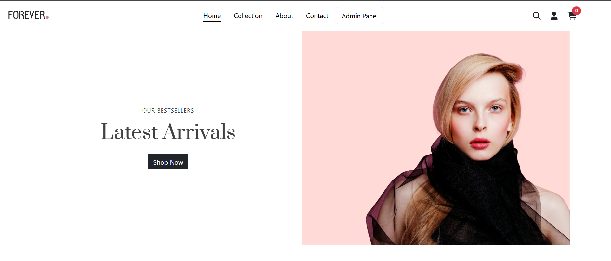

# ForEver - MERN Stack eCommerce Store

ForEver is a full-featured eCommerce platform built using the MERN stack (MongoDB, Express.js, React.js, and Node.js). It allows customers to browse and purchase products, while admins have the ability to manage inventory and update order statuses.

## Features

### 🛒 User Features

- Browse and search for products
- Add products to cart and checkout
- Secure authentication and order tracking

### 🔧 Admin Features

- Add, update, and delete products
- Manage orders and update their status
- View customer orders and details

## Tech Stack

- **Frontend:** React.js, Bootstrap
- **Backend:** Node.js, Express.js
- **Database:** MongoDB
- **Authentication:** JWT
- **State Management:** Redux
- **Hosting:** Deployed on a cloud platform

## Installation

1. Clone the repository:

   ```sh
   git clone https://github.com/abdullazmat/ecommerce-forever.git
   cd your-repo
   ```

2. Install dependencies:

   ```sh
   npm install
   ```

3. Start the development servers:

   ```sh
   # Start backend server
   npm run server
   
   # Start frontend server
   npm start
   ```


## License

This project is open-source and anyone can contribute.

---
